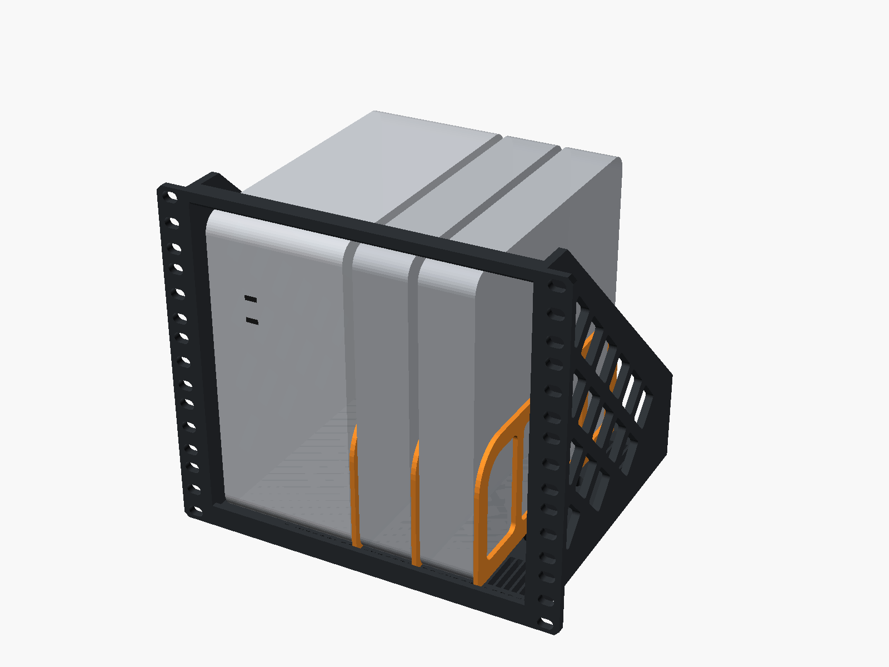
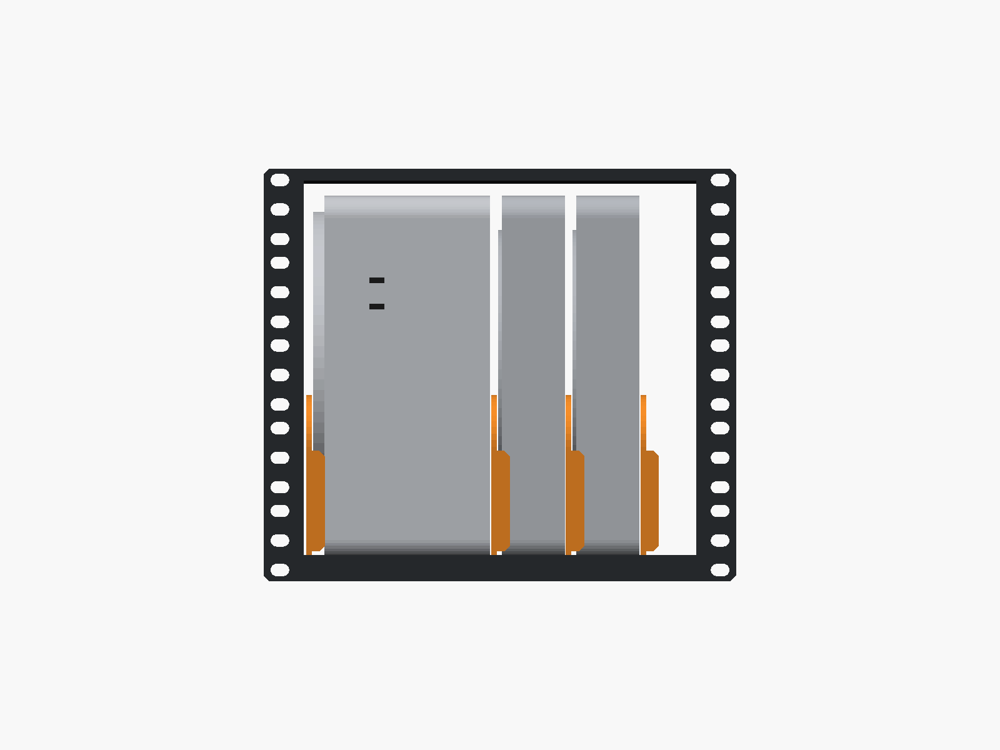
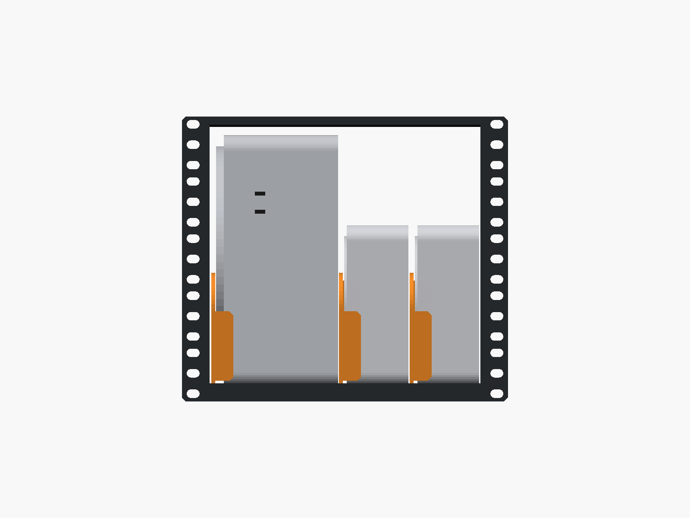
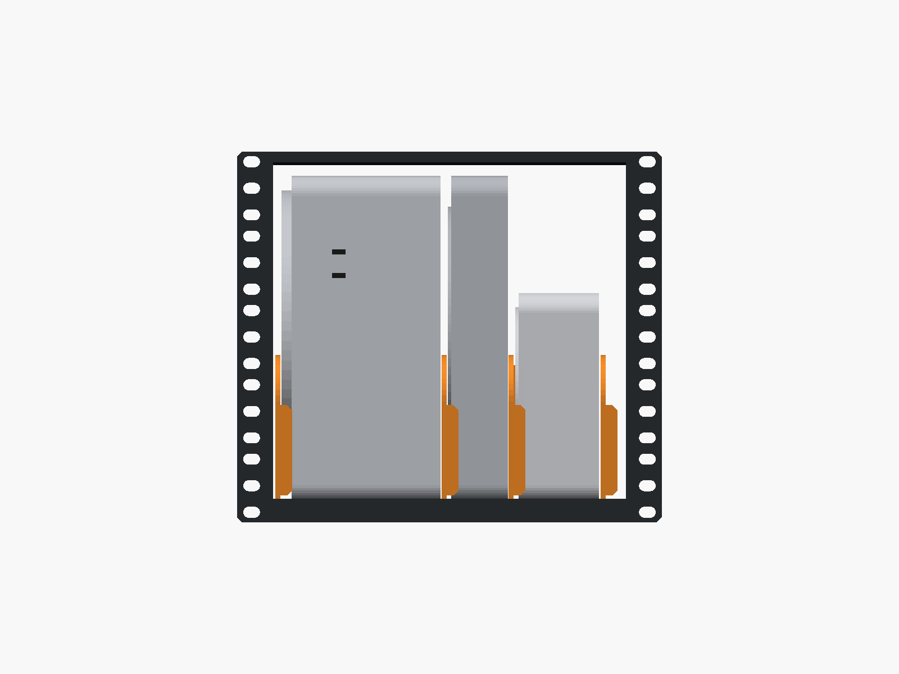
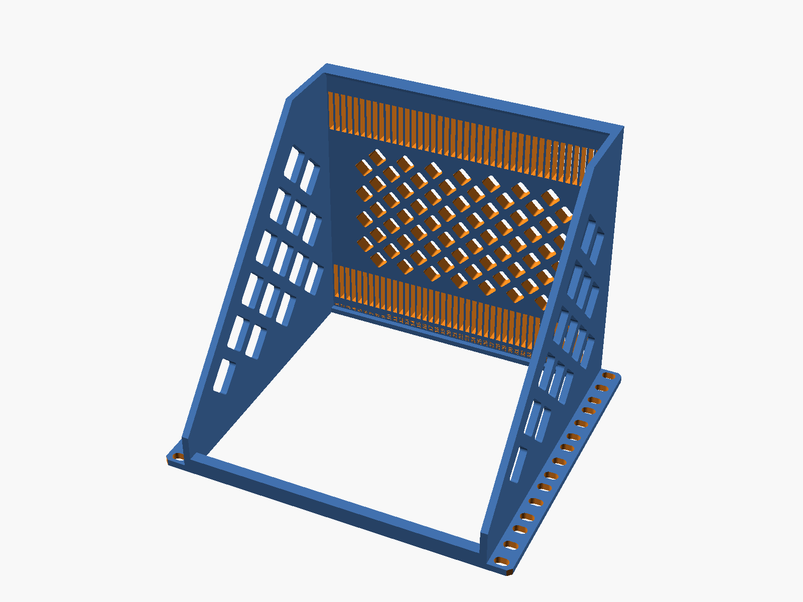
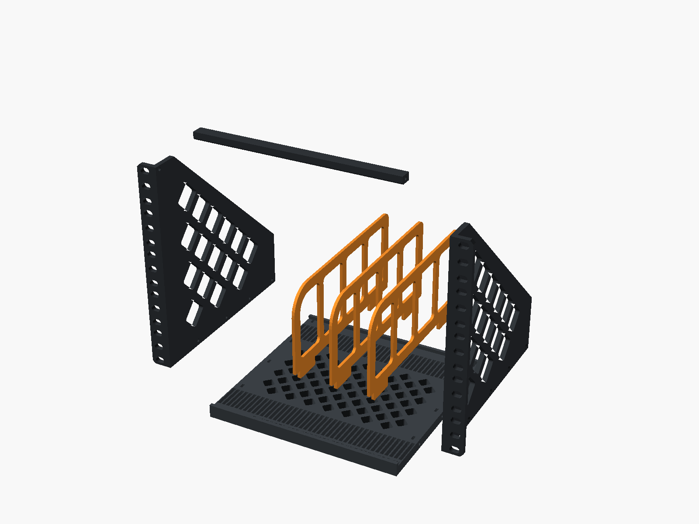
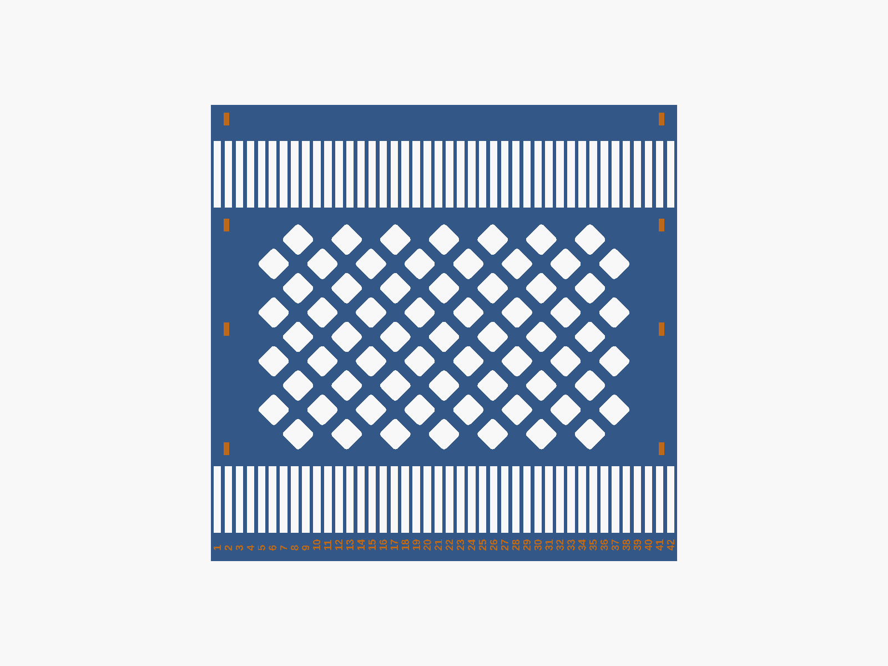

# 10" rack cradle: Mac Studio + 2× Mac mini

A 5U, 3D-printable cradle for a 10-inch rack. It holds one Mac Studio standing on its side and two Mac minis standing on edge beside it. The minis sit between movable separators, so the same frame works with M1 minis now and M4 minis later.

There are two ways to build it:

- **One piece.** The whole frame is a single print on a 256 × 256 × 256 mm printer (Bambu X1/P1/A1 class). It needs no screws and no supports.
- **Bolt-together.** Five smaller parts fit a 235 mm bed and are joined with 10 M3 screws.

Both builds use the same separators.

| 2× M1 (now) | 2× M4 (later) | M1 + M4 |
|---|---|---|
|  |  |  |

## Why the Studio stands on its side

A 10" rack has 222.25 mm (8.75") between the rails. The Mac Studio and the M1 Mac mini are both 197 mm wide, so nothing fits beside a Studio lying flat.

On its side the Studio is 95 mm wide. That leaves about 110 mm next to it, which fits two minis on edge:

| Device | Footprint | On edge |
|---|---|---|
| Mac Studio | 197 × 197 × 95 mm | 95 mm wide, 197 mm tall |
| Mac mini M1 (2020) | 197 × 197 × 36 mm | 36 mm wide, 197 mm tall |
| Mac mini M4 (2024) | 127 × 127 × 50 mm | 50 mm wide, 127 mm tall |

The tallest device is 197 mm, so the cradle is 5U (222.25 mm).

The Studio's air intake is on its underside, so that face goes against the open left side frame. Exhaust from all three Macs goes out the back, which is open.

The floor between the two slot rows is a field of diamond vents, so air can rise into the bays from below. The vents only help if the rack space under the cradle is open (an empty or vented U), not blocked by another device.

## Separator slots

The floor has 42 slots at a 5 mm pitch. They are numbered 1–42 from the left, and the numbers are engraved along the front edge of the floor. The slots go all the way through the 10 mm floor. Each separator has two tabs that drop 9.5 mm into one slot position.

| Layout | Separators in slots | Bays (left → right) |
|---|---|---|
| Studio + 2× M1 | **20, 28, 36** | Studio 96.4 · M1 37 · M1 37 · spare 31.4 mm |
| Studio + 2× M4 | **20, 31, 42** | Studio 96.4 · M4 52 · M4 52 mm |
| Studio + M1 + M4 | **20, 28, 39** | Studio 96.4 · M1 37 · M4 52 · spare 16.4 mm |
| Studio + M4 + M1 | **20, 31, 39** | Studio 96.4 · M4 52 · M1 37 · spare 16.4 mm |

Side-to-side play is 1.4 mm for the Studio, 1 mm for an M1 and 2 mm for an M4. The slot grid is symmetric, so the Studio can go on the right instead. Then the separators go in slots **23, 15, 7** for M1 minis or **23, 12, 1** for M4 minis.

The spare bay in the M1 layout (~31 mm) is wide enough for something thin, such as a USB hub or a slim SSD enclosure.

## Build A: one piece (256 mm printer)

| File | Qty | Size (mm) |
|---|---|---|
| [`stl/frame_onepiece.stl`](stl/frame_onepiece.stl) | 1 | 254 × 221.5 × 206.5 |
| [`stl/separator.stl`](stl/separator.stl) | 3 | 198 × 95 × 3 |

The frame STL is already in print orientation: **face-down**, with the rack ears and the front edges on the bed. Printed this way:

- The top bar sits on the plate instead of bridging 210 mm in mid-air.
- The side-frame cutouts are 45° diamonds, and the rear stop is a 45° ramp.
- The floor vents are 45° diamonds as well.
- The widest bridge is 3.4 mm, at the tops of the separator slots.

It needs no supports.

The frame is 254 mm wide, which leaves about 1 mm on each side of a 256 mm plate. Center it, and don't add an outer brim. The part touches the bed only along a thin rectangular outline, so make sure the plate is clean. If you want more grip, use an inner-only brim or a little glue stick.

**Suggested settings:** PETG or ASA, 0.2 mm layers, 4 walls, 15–20% gyroid infill. PLA can soften over time next to a warm Mac Studio. The frame takes about 0.5 kg of filament. The separators print flat with 3 walls.

**Hardware:** only 4–6 rack screws, plus cage nuts if your rails need them. The ear slots are 6.6 × 10 mm, which fits M6, M5 and 10-32 screws and rail hole spacings from 235 to 237 mm.

**Setup:**

1. Put the separators in the slots for your layout (see the table above).
2. Mount the frame in the rack with at least 2–3 screws per ear, including the top and bottom positions.
3. Slide the Studio in on its side, with its underside facing the left frame. Then slide in the minis. Lift each one slightly to clear the 4 mm lip on the front edge. There is 6.4 mm of headroom under the top bar.

## Build B: bolt-together (235 mm bed)

| File | Qty | Size (mm) | Notes |
|---|---|---|---|
| [`stl/bolted/side_frame_left.stl`](stl/bolted/side_frame_left.stl) | 1 | 221 × 207 × 22 | Prints inner face down. The rack ear stands up. |
| [`stl/bolted/side_frame_right.stl`](stl/bolted/side_frame_right.stl) | 1 | 221 × 207 × 22 | Same as the left frame, mirrored. |
| [`stl/bolted/floor.stl`](stl/bolted/floor.stl) | 1 | 211 × 207 × 14 | Prints top face up. |
| [`stl/bolted/top_bar.stl`](stl/bolted/top_bar.stl) | 1 | 211 × 12 × 8 | Ties the frames together at the top front. |
| [`stl/separator.stl`](stl/separator.stl) | 3 | 198 × 95 × 3 | Prints flat. |

All parts are in print orientation and need no supports. The largest part is 222 × 211 mm. Any bed that is 235 × 235 mm or larger works. A 250 × 210 mm bed (Prusa MK4) also works if you turn the parts lengthwise.

**Suggested settings:** the same material and layer height as the one-piece build.

| Part | Walls | Infill |
|---|---|---|
| Side frames | 4 | 25% gyroid |
| Floor | 3 | 15–20% |
| Top bar | 4 | 40% |

**Hardware:**

- 10× M3 × 16 countersunk screws (DIN 7991 / ISO 10642)
- 10× M3 hex nuts
- 4–6 rack screws

**Assembly:**

1. Drop an M3 nut into each of the 8 slots near the side edges of the floor. Slide one nut into each of the 2 slots in the back face of the top bar.
2. Hold a side frame against each side of the floor, with the ears at the front. Fasten each frame with 4 countersunk screws from the outside.
3. Fit the top bar between the top front corners of the frames, with one screw per side.
4. Then follow the setup steps for the one-piece build.

## Load

Everything hangs from the front rails: a Studio (2.7–3.6 kg) plus two M1 minis (1.2 kg each). The diamond lattice in each side frame carries that load back to the rack ears. If your rack has a shelf or a support point under the cradle, use it as well.

## Rack requirements

- 222.25 mm clear between the rails. The cradle body is 220.75 mm wide.
- About 207 mm of depth behind the front face of the ears, plus about 60 mm behind that for cables.
- 5U of vertical space.

## Customizing

Everything is in [`mac_rack_shelf.scad`](mac_rack_shelf.scad) (OpenSCAD 2021.01 or newer). Open it in OpenSCAD and use the Customizer, or set values on the command line. Useful parameters:

| Parameter | Default | What it does |
|---|---|---|
| `part` | `assembly` | What to render: `assembly`, `frame_onepiece`, `separator`, or a bolted part |
| `build` | `onepiece` | Frame used in the assembly preview: `onepiece` or `bolted` |
| `config` | `m1` | Preset used in the assembly preview: `m1`, `m4`, `m1_m4`, `m4_m1` |
| `rack_opening` | 222.25 | Clear width between your rack's rails |
| `rail_hole_pitch` | 236.5 | Centre-to-centre of the rail holes |
| `slot_w` / `tab_clear` | 3.4 / 0.3 | Separator fit. Raise `slot_w` if the tabs are too tight on your printer. |
| `floor_vents` | `true` | Diamond vents in the floor between the slot rows |
| `vent_pitch` / `vent_strut` | 22 / 5 | Vent size and rib width |
| `sep_h` | 90 | Separator height above the floor |
| `studio_dim`, `m1_dim`, `m4_dim` | Apple specs | Device sizes used for the preview |

To regenerate the STLs and images, run `./build.sh`. On a headless machine, run `xvfb-run -a ./build.sh`.

