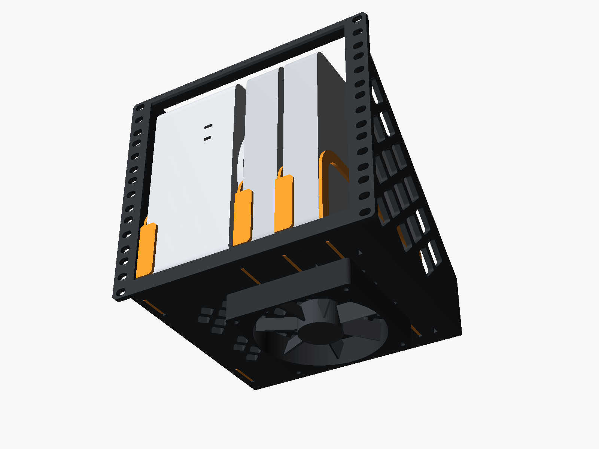

# 10" rack cradle: Mac Studio + 2× Mac mini

A 5U, 3D-printable cradle for a 10-inch rack. It holds one Mac Studio standing on its side and two Mac minis standing on edge beside it. The minis sit between movable separators, so the same frame works with M1 minis now and M4 minis later.

There are two ways to build it:

- **One piece.** The whole frame is a single print on a 256 × 256 × 256 mm printer (Bambu X1/P1/A1 class). It needs no screws and no supports.
- **Bolt-together.** Five smaller parts fit a 235 mm bed and are joined with 10 M3 screws.

Both builds use the same separators.

| 2× M1 (now) | 2× M4 (later) | M1 + M4 |
|---|---|---|
|  |  |  |

## Why the Studio stands on its side

A 10" rack has 222.25 mm (8.75") between the rails. The Mac Studio and the M1 Mac mini are both 197 mm wide, so nothing fits beside a Studio lying flat.

On its side the Studio is 95 mm wide. That leaves about 110 mm next to it, which fits two minis on edge:

| Device | Footprint | On edge |
|---|---|---|
| Mac Studio | 197 × 197 × 95 mm | 95 mm wide, 197 mm tall |
| Mac mini M1 (2020) | 197 × 197 × 36 mm | 36 mm wide, 197 mm tall |
| Mac mini M4 (2024) | 127 × 127 × 50 mm | 50 mm wide, 127 mm tall |

The tallest device is 197 mm, so the cradle is 5U (222.25 mm).

The Studio's air intake is on its underside, so that face points **right**, toward the minis. Its foot holds the underside about 6 mm off the slot-2 separator. That leaves a gap down to the floor, right above the optional bottom fan (see below). Exhaust from all three Macs goes out the back, which is open. If you'd rather face the intake toward the open left side frame, set `studio_intake = "left"`. The bay is the same either way.

The floor between the two slot rows is a field of diamond vents, so air can rise into the bays from below. A solid band runs side to side across the middle of the vents. It stiffens the floor where it would otherwise sag most. The vents only help if the rack space under the cradle is open (an empty or vented U), not blocked by another device.

## Separators and doorstops

The floor has 6 separator slots. Count them from the left:

- **Slot 1** sits against the left side frame, on the Studio's left.
- **Slot 2** is the Studio's right-hand separator.
- **Slot 3** is where a separator goes after an M1.
- **Slot 4** is where a separator goes after an M4.
- **Slot 5** is where a separator goes after two M1s.
- **Slot 6** is where a separator goes after an M1 and an M4, in either order.

The slots go all the way through the 10 mm floor. Each separator drops 9.5 mm into one slot.

**Why only 6 slots:** the earlier version had a slot every 5 mm. That left walls only 1.6 mm thick between slots, held only at their ends and printed with the layer lines running across them. A firm sideways push on one separator (very roughly 4 kg) could crack one. With only the slots your layouts use, the thinnest wall is 11.6 mm. Strength grows with the square of thickness, so that's about 50× stronger, and the floor is much stiffer side to side. If you ever need other bay widths, set `slot_mode = "grid"` to get the 5 mm slots back. Treat those thin walls gently.

Every Mac has a separator on its left. Each separator has two **doorstops** on its right-hand side. They hook around the front and back edges of the Mac to their right, so that Mac can't slide out the front or back of the rack. They don't wrap all the way around.

- **Front doorstops** reach **14 mm** across the Mac's front. They cover only the edge closest to the separator, between 6 and 60 mm above the floor. The M4's front ports are in the middle of its 50 mm face, so they stay clear. With the Studio's underside facing right, its front ports end up on the right side of the face, away from its doorstop on the left. I couldn't measure exact port positions, so check against your Macs before printing.
- **Rear doorstops** reach 14 mm on the M4 separator. On the Studio/M1 separator they stay at **7 mm**, because the M1's rear ports run down the middle of its 36 mm back and an Ethernet or HDMI plug starts about 10 mm in. Change `rear_reach_studio_m1` if your plugs allow more.

The rear doorstop has to sit right behind the Mac it holds, and the separator after the last mini holds nothing. That gives three separator versions:

| File | Holds | Doorstops |
|---|---|---|
| [`stl/separator_studio_m1.stl`](stl/separator_studio_m1.stl) | the Studio or an M1 (197 mm deep) | front 14 mm; rear 7 mm at the back end |
| [`stl/separator_m4.stl`](stl/separator_m4.stl) | an M4 (127 mm deep) | front 14 mm; rear 14 mm, partway back and set high |
| [`stl/separator_end.stl`](stl/separator_end.stl) | nothing (it sits after the last mini) | none |

| Layout | Separators in slots | Bays (left → right) |
|---|---|---|
| Studio + 2× M1 | **1, 2, 3** Studio/M1, **5** end | Studio 96.4 · M1 37 · M1 37 · spare 27 mm |
| Studio + 2× M4 | **1** Studio/M1, **2, 4** M4 | Studio 96.4 · M4 52 · M4 52 mm (against the side frame) |
| Studio + M1 + M4 | **1, 2** Studio/M1, **3** M4, **6** end | Studio 96.4 · M1 37 · M4 52 · spare 12 mm |
| Studio + M4 + M1 | **1** Studio/M1, **2** M4, **4** Studio/M1, **6** end | Studio 96.4 · M4 52 · M1 37 · spare 12 mm |

Side-to-side play is 1.4 mm for the Studio, 1 mm for an M1 and 2 mm for an M4. Front-to-back play between the doorstops is 1 mm. For your M1 setup, print three Studio/M1 separators and one end separator. When you move to M4 minis, print two M4 separators.

The floor under the Studio has no slots, so it stays solid under the heaviest Mac. The spare bay in the M1 layout (about 27 mm) is wide enough for something thin, such as a USB hub or a slim SSD enclosure.

### Putting Macs in and taking them out

A separator can't slide past the Mac it holds, so you put Macs in from left to right:

1. Drop the slot-1 separator in.
2. Slide the Studio in about 1.5 cm to the right of its bay, then push it left so it tucks behind the doorstops.
3. Drop in the separator on the Studio's right.
4. Repeat for each mini.

To take Macs out, work from the right:

1. Lift out the separator on a Mac's right.
2. Slide the Mac about 1.5 cm right so it clears the doorstops on its left.
3. Pull the Mac out the front.

An M4 separator is easier, because its rear doorstop sits high: lift it about 85 mm, clear of the 127 mm-tall M4, and pull it out the front.

If you'd rather take any Mac out without touching the others, set `doorstop_rear = false` and re-export the separators. You then get front doorstops only. To remove a Mac, lift its left separator 10 mm, pull the separator out, then pull the Mac out. The 4 mm ramp at the back of the floor still stops a Mac from sliding off the back.

## Bottom fan (optional)

The floor has four countersunk holes for a standard **120 mm fan** (105 mm screw spacing). The fan mounts underneath and blows up through the floor vents. It's centred 25 mm right of the Studio's right-hand separator, so it sits mostly under the minis. The Studio's intake gap lies over the fan's blades rather than its dead center hub.

- **Hardware:** 4× M4 × 40 countersunk screws and 4× M4 nuts (nylon-insert nuts won't vibrate loose). They go down through the floor and the fan's corner holes. The heads sit flush with the floor. For a 15 mm slim fan, use M4 × 30. A standard 120 mm finger guard can go under the fan on the same screws.
- **Rack space:** the fan hangs 25 mm below the cradle, inside the 1U under it. Leave that U empty so the fan can pull air in.
- **Power:** a 5 V USB fan (for example a 5 V Noctua 120 mm) can run off a spare USB port on one of the Macs. A 12 V fan needs its own supply.
- **Where the air goes:** the Macs sit right on the floor, so they cover most of the vents under them. The air comes up through the gaps between them: the Studio's intake gap, the separator windows, and the space between the minis. Open floor where no Mac sits, such as the spare bay or behind the shorter M4s, is an easy escape route. If you want to push more air into the Macs, cover those vents with tape.

Set `fan_mount = false` to leave the holes out.

## Build A: one piece (256 mm printer)

| File | Qty | Size (mm) |
|---|---|---|
| [`stl/frame_onepiece.stl`](stl/frame_onepiece.stl) | 1 | 254 × 221.5 × 206.5 |
| [`stl/separator_studio_m1.stl`](stl/separator_studio_m1.stl) | 3 for 2× M1 | 204 × 100 × 17 |
| [`stl/separator_m4.stl`](stl/separator_m4.stl) | 2 for 2× M4 (later) | 204 × 100 × 17 |
| [`stl/separator_end.stl`](stl/separator_end.stl) | 1 for 2× M1 | 198 × 100 × 3 |

The frame STL is already in print orientation: **face-down**, with the rack ears and the front edges on the bed. Printed this way:

- The top bar sits on the plate instead of bridging 210 mm in mid-air.
- The side-frame cutouts are 45° diamonds, and the rear stop is a 45° ramp.
- The floor vents are 45° diamonds as well.
- The widest bridge is 3.4 mm, at the tops of the separator slots.

It needs no supports.

The frame is 254 mm wide, which leaves about 1 mm on each side of a 256 mm plate. Center it, and don't add an outer brim. The part touches the bed only along a thin rectangular outline, so make sure the plate is clean. If you want more grip, use an inner-only brim or a little glue stick.

**Suggested settings:** PETG or ASA, 0.2 mm layers, 4 walls, 15–20% gyroid infill. PLA can soften over time next to a warm Mac Studio. The frame takes about 0.5 kg of filament. The separators print flat on their left face with the doorstops pointing up. They use 3 walls and need no supports.

**Hardware:** only 4–6 rack screws, plus cage nuts if your rails need them. The ear slots are 6.6 × 10 mm, which fits M6, M5 and 10-32 screws and rail hole spacings from 235 to 237 mm. The optional bottom fan needs 4 M4 × 40 countersunk screws and nuts.

**Setup:**

1. Mount the frame in the rack with at least 2–3 screws per ear, including the top and bottom positions.
2. Load the separators and Macs left to right, as described under "Putting Macs in and taking them out". The Studio goes on its side with its underside facing right, toward the minis. Lift each Mac slightly to clear the 4 mm lip on the front edge. There is 6.4 mm of headroom under the top bar.

## Build B: bolt-together (235 mm bed)

| File | Qty | Size (mm) | Notes |
|---|---|---|---|
| [`stl/bolted/side_frame_left.stl`](stl/bolted/side_frame_left.stl) | 1 | 221 × 207 × 22 | Prints inner face down. The rack ear stands up. |
| [`stl/bolted/side_frame_right.stl`](stl/bolted/side_frame_right.stl) | 1 | 221 × 207 × 22 | Same as the left frame, mirrored. |
| [`stl/bolted/floor.stl`](stl/bolted/floor.stl) | 1 | 211 × 207 × 14 | Prints top face up. |
| [`stl/bolted/top_bar.stl`](stl/bolted/top_bar.stl) | 1 | 211 × 12 × 8 | Ties the frames together at the top front. |
| `stl/separator_*.stl` | per layout | 204 × 100 × 17 | Same separators as the one-piece build. |

All parts are in print orientation and need no supports. The largest part is 222 × 211 mm. Any bed that is 235 × 235 mm or larger works. A 250 × 210 mm bed (Prusa MK4) also works if you turn the parts lengthwise.

**Suggested settings:** the same material and layer height as the one-piece build.

| Part | Walls | Infill |
|---|---|---|
| Side frames | 4 | 25% gyroid |
| Floor | 3 | 15–20% |
| Top bar | 4 | 40% |

**Hardware:**

- 10× M3 × 16 countersunk screws (DIN 7991 / ISO 10642)
- 10× M3 hex nuts
- 4–6 rack screws
- Optional bottom fan: 4× M4 × 40 countersunk screws and 4× M4 nuts

**Assembly:**

1. Drop an M3 nut into each of the 8 slots near the side edges of the floor. Slide one nut into each of the 2 slots in the back face of the top bar.
2. Hold a side frame against each side of the floor, with the ears at the front. Fasten each frame with 4 countersunk screws from the outside.
3. Fit the top bar between the top front corners of the frames, with one screw per side.
4. Then follow the setup steps for the one-piece build.

## Load

Everything hangs from the front rails: a Studio (2.7–3.6 kg) plus two M1 minis (1.2 kg each). The diamond lattice in each side frame carries that load back to the rack ears. If your rack has a shelf or a support point under the cradle, use it as well.

## Rack requirements

- 222.25 mm clear between the rails. The cradle body is 220.75 mm wide.
- About 207 mm of depth behind the front face of the ears, plus about 60 mm behind that for cables.
- 5U of vertical space.

## Customizing

Everything is in [`mac_rack_shelf.scad`](mac_rack_shelf.scad) (OpenSCAD 2021.01 or newer). Open it in OpenSCAD and use the Customizer, or set values on the command line. Useful parameters:

| Parameter | Default | What it does |
|---|---|---|
| `part` | `assembly` | What to render: `assembly`, `frame_onepiece`, `separator_studio_m1`, `separator_m4`, or a bolted part |
| `build` | `onepiece` | Frame used in the assembly preview: `onepiece` or `bolted` |
| `config` | `m1` | Preset used in the assembly preview: `m1`, `m4`, `m1_m4`, `m4_m1` |
| `rack_opening` | 222.25 | Clear width between your rack's rails |
| `rail_hole_pitch` | 236.5 | Centre-to-centre of the rail holes |
| `slot_w` / `tab_clear` | 3.4 / 0.3 | Separator fit. Raise `slot_w` if the tabs are too tight on your printer. |
| `floor_vents` | `true` | Diamond vents in the floor between the slot rows |
| `vent_spine` | 10 | Width of the solid band across the middle of the vents (0 removes it) |
| `slot_mode` | `presets` | `presets`: the 6 slots the layouts use. `grid`: a slot every 5 mm (thinner walls). |
| `doorstop_rear` | `true` | Set to `false` for front doorstops only, so any Mac slides out on its own |
| `doorstop_reach` | 14 | How far the front doorstops (and the M4 rear one) hook across a Mac |
| `fan_mount` | `true` | Screw holes for a 120 mm fan under the floor |
| `fan_offset_x` | 25 | Fan centre, in mm right of the Studio's right-hand separator |
| `studio_intake` | `right` | Which way the Studio's underside (air intake) faces |
| `rear_reach_studio_m1` | 7 | How far the Studio/M1 rear doorstop hooks across the back. It's kept short to clear the M1's rear plugs. |
| `studio_play` | 1.4 | Side-to-side play in the Studio bay. This also sets where slot 1 sits. |
| `vent_pitch` / `vent_strut` | 22 / 5 | Vent size and rib width |
| `sep_h` | 90 | Separator height above the floor |
| `studio_dim`, `m1_dim`, `m4_dim` | Apple specs | Device sizes used for the preview |

To regenerate the STLs and images, run `./build.sh`. On a headless machine, run `xvfb-run -a ./build.sh`.

